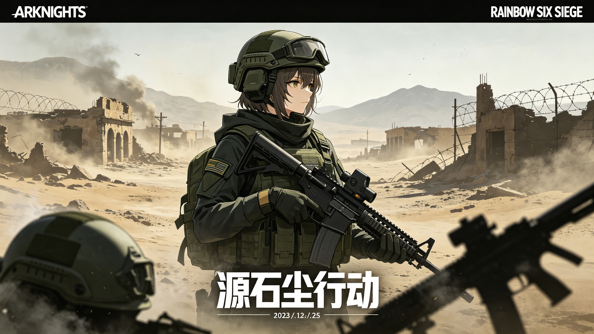
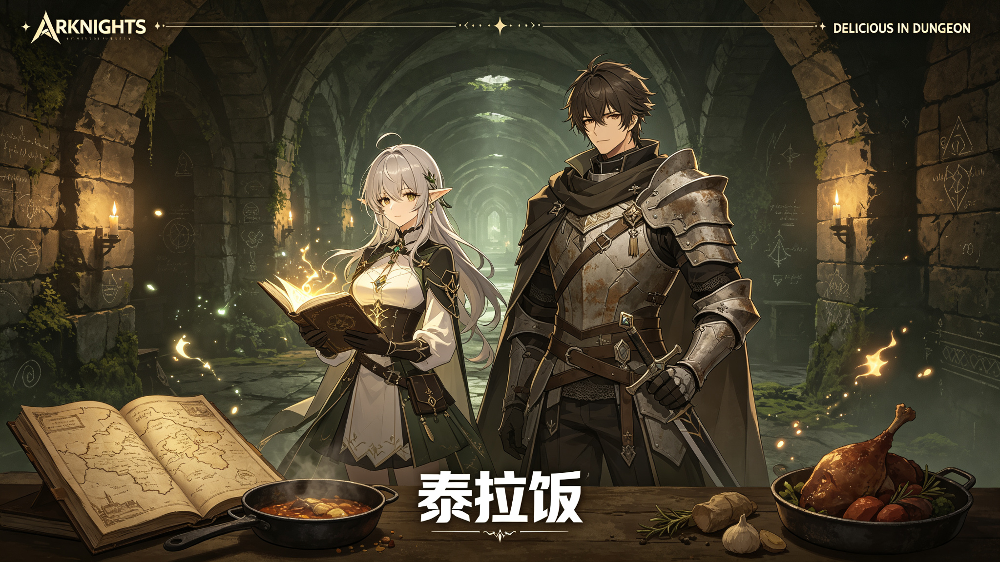
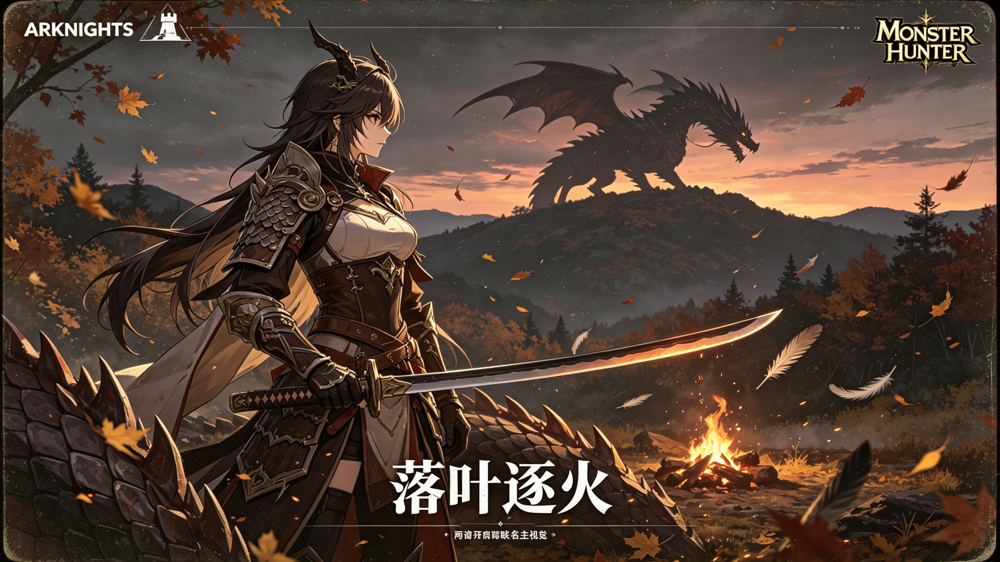

# Arknights Visual Design Skills

> A collection of AI Agent Skills for **generating and evaluating** content in the art style of *Arknights* (明日方舟), organized by **output medium** — **Static Image** (poster / key art / operator illustrations) and **Dynamic Video + UI** (animation / PV / motion & interface).

> **提示**：本项目文档以英文编写；Skill 内容与 AI 交互将以你的首选语言回答。

[](LICENSE)
[](#skills)
[](#design-philosophy)
[](#quick-reference)

---

## Table of Contents

- [Overview](#overview)
- [Skills](#skills)
- [Quick Start](#quick-start)
- [Quick Reference — Core Design Tokens](#quick-reference--core-design-tokens)
- [Design Philosophy](#design-philosophy)
- [Repository Structure](#repository-structure)
- [Demo Showcase](#demo-showcase)
- [Contributing](#contributing)
- [License](#license)
- [Copyright Notice](#copyright-notice)

---

## Overview

This repository hosts **two medium-oriented skills** that split by **output type**, so you load only the specification relevant to the tool you're using:

| Skill | Output Medium | Covers | Best For |
|-------|---------------|--------|----------|
| **arknights-image-style** | Static image | Poster / key visual (KV) / operator illustration / IP-collab key art / anniversary & seasonal art | Image generation & editing (image_gen / image_edit) |
| **arknights-video-style** | Dynamic video + UI | Animation / PV / skill performance / Live2D / interface motion / game UI | Video generation (text_to_video / image_to_video) & UI design |

> **Which to use?** Picking **image**? Use `arknights-image-style`. Picking **video or UI**? Use `arknights-video-style`. Each skill ships with a **generation mode** and an **evaluation mode** (scorecard + taboo veto), so you can both create and review content.

---

## Skills

### 1. arknights-image-style (Static Image / Poster & Key Art)

Specification for **still visual output**: event key visuals, character illustrations, IP-collaboration key art, anniversary art, seasonal/merch/social assets. Includes quantified composition, color, lighting, texture, typography, and collaboration rules.

| File | Description |
|------|-------------|
| [SKILL.md](arknights-image-style/SKILL.md) | Main entry: YAML frontmatter, generate & evaluate workflows, quick reference |
| [references/poster-style.md](arknights-image-style/references/poster-style.md) | Complete poster / key art / illustration spec (12 chapters) |

### 2. arknights-video-style (Dynamic Video + UI)

Specification for **dynamic and interface output**: promotion PV / trailer, skill performance, story cutscenes, Live2D motion, interface animation, and Arknights-styled game UI. Includes rhythm, camera, character animation, VFX, transitions, sound, Live2D, and UI component rules.

| File | Description |
|------|-------------|
| [SKILL.md](arknights-video-style/SKILL.md) | Main entry: YAML frontmatter, generate & evaluate workflows, quick reference |
| [references/animation-style.md](arknights-video-style/references/animation-style.md) | Complete animation / PV / motion spec (12 chapters) |
| [references/ui-style.md](arknights-video-style/references/ui-style.md) | Complete UI / interface spec (12 chapters) |

---

## Quick Start

### Method 1: Manual install (recommended, most reliable)

```bash
# Clone the repository
git clone https://github.com/ganmayou2333/Arknights-Visual-Design-Skills.git

# Or download: Code → Download ZIP
```

Copy the desired skill folder into your agent's skills directory:

| Environment | Typical Path |
|-------------|-------------|
| Doubao / Super Doubao | `~/.super_doubao/super-doubao-runtime/workspace/.user_skills/` |
| GitHub Copilot | `~/.codex/skills/` |
| Claude / Other Agents | `~/.agents/skills/` |

```bash
# For static image generation
cp -r arknights-image-style /path/to/your/skills/directory/
# For video / UI
cp -r arknights-video-style /path/to/your/skills/directory/
```

Restart your agent session, then test:

> *"Design an Arknights-style event key visual (KV)"* → uses `arknights-image-style`
> *"Create an Arknights-style operator profile UI"* → uses `arknights-video-style`

### Method 2: AI-prompt install

Copy and paste the prompt below — it installs **both** skills from this repo, verifies the result, and falls back gracefully if the repo is unreachable. Paste it as-is; your agent will handle the rest and reply in your preferred language:

```text
[TASK] Install two AI Agent skills for the Arknights (明日方舟) art style into the user skills directory (.user_skills).

## 0. Environment Pre-check (do this first)
- Check whether arknights-image-style and arknights-video-style already exist under .user_skills/.
- If both already exist AND pass the structure check (see Step 4), report "already installed", skip Steps 1–3, and do NOT re-download.

## 1. Source & Mapping (repo dir names ≠ target skill names)
- Clone the repository: https://github.com/ganmayou2333/Arknights-Visual-Design-Skills
- The repo contains two dirs: arknights-design-style-guide/ and arknights-visual-style/. Map and split them into .user_skills/ as follows:
    - Static poster/illustration/collab-key-art specs → skill: arknights-image-style
    - Animation/PV/UI/motion specs → skill: arknights-video-style

## 2. Target Structure (none may be missing)
Skill 1 — arknights-image-style (static images):
    SKILL.md                      —— YAML frontmatter: triggers include poster / illustration / KV / collab key art; note that "animation/PV/UI is handled by arknights-video-style"
    references/poster-style.md    —— 12-chapter quantified spec, ending with a "Poster Taboo Checklist"
Skill 2 — arknights-video-style (dynamic video + UI):
    SKILL.md                      —— YAML frontmatter: triggers include animation / PV / skill performance / Live2D / interface motion / game UI; note that "static posters are handled by arknights-image-style"
    references/animation-style.md —— 12-chapter quantified spec, ending with an "Animation Taboo Checklist"
    references/ui-style.md        —— 12-chapter quantified spec, ending with a "UI Taboo Checklist"

## 3. Content Hard Requirements (apply to all skills)
- All body text MUST be written in Simplified Chinese.
- Every parameter MUST be quantified: hex color values, px, seconds/ms, percentages, font sizes, corner cut, opacity, durations, camera-share ratios, etc. Vague terms like "about / moderate" are forbidden.
- Every SKILL.md MUST include BOTH:
    a. A generation-mode workflow (read spec → identify category → execute → self-check);
    b. An evaluation mode: a 0–10 scorecard (each dimension scored out of 10) plus a total score, using a taboo-veto rule (hitting any item in the corresponding taboo checklist → fail immediately).

## 4. Post-Install Item-by-Item Verification (must not just report "files exist")
- [ ] Both skill dirs exist; references files are complete (2 / 3 files).
- [ ] Each SKILL.md has valid YAML frontmatter with correct name / description / triggers.
- [ ] All 3 references files have ≥12 chapters and end with the corresponding "Taboo Checklist".
- [ ] Each SKILL.md contains both the "generation workflow" and the "0–10 evaluation + taboo veto" sections.
- [ ] Body text is Simplified Chinese with no unquantified vague parameters.
- If any item fails: fix it in place; do not skip.

## 5. Fallback Strategy (execute when the repo is unreachable or malformed; never skip delivery)
- If clone fails or the repo is unreachable (network / firewall / private):
    - Do not retry network more than once;
    - Instead WRITE both skills from scratch per the Step 2 & 3 specs (fully original, not dependent on the repo), and label the source as "spec authored from scratch, not repo-cloned".
- If the repo is reachable but its internal structure/chapters fail Step 2 & 3:
    - Take Step 2 & 3 as authoritative; supplement, split, or rewrite the repo content until it passes;
    - Report which chapters were adopted directly vs. supplemented/rewritten.
- The Step 4 verification still applies after any fallback.

## 6. Delivery
- Reply in the language the user is currently using (Japanese if the user writes Japanese, Chinese if Chinese, and so on).
- Show the confirmed full file-structure tree; give a ✅/❌ result with justification for every item in Step 4; state the source method (repo-cloned / from-scratch / mixed).
```

**How to use**: paste the prompt → wait 1–3 minutes for generation → verify `references/` files exist → restart/reload the session. If your agent lacks skill-creation support, use [Method 1: manual install](#method-1-manual-install-recommended-most-reliable).

---

## Which skill should I use? (FAQ)

| 你要做什么 / What you want | 用哪个 / Use |
|---|---|
| 一张海报、主视觉、角色立绘、联名宣传图 | **arknights-image-style** |
| 一段动画、PV、技能演出、Live2D | **arknights-video-style** |
| 一个明日方舟风格的界面 / UI | **arknights-video-style** |
| 既有图片改造成舟味 | **arknights-image-style** |
| 既有视频 / 界面改造成舟味 | **arknights-video-style** |

**Q1: 我想生成一张「明日方舟风格的活动主视觉」，该用哪个？**
A: 用 **arknights-image-style**。这是静态图片产物（KV/海报/立绘），走生图流程；它只加载海报规范，轻量聚焦。

**Q2: 我想做一个「明日方舟风格的干员档案界面」呢？**
A: 用 **arknights-video-style**。虽然界面不是"视频"，但它属于 UI 规范，和界面动效、动画同属该技能体系（UI 是它的第二分册）。

**Q3: 海报和 UI 都属于静态画面，为什么一个归生图、一个归视频？**
A: 因为按**产物类型**分流——海报/立绘是"输出一张图"，走生图工具；UI 是"输出一套带动效的界面系统"，和动画共用同一套克制、战术的规范语言，所以归到视频+UI 技能，方便界面动效一起管理。

**Q4: 两个技能能同时用吗？**
A: 可以。复合任务（如"联名宣传图 + 配套 HUD 界面"）可同时让两个技能各按其规范执行，互不冲突。

---

## Quick Reference — Core Design Tokens

| Element | Value |
|---------|-------|
| **Base background** | `#1A1C20` (dark charcoal — never pure black) |
| **Panel** | `#2B2D31` |
| **Primary brand** | `#3F72AF` (Rhodes Island blue, ≤15% of screen) |
| **Accent / success** | `#56B6C9` (Originium cyan) |
| **Warning** | `#E08E45` (dark orange) |
| **Danger** | `#B84A4A` (dark red) |
| **Border** | `#3F4349` — 1px solid |
| **Primary text** | `#FFFFFF` |
| **Secondary text** | `#C9CDD4` |
| **Tertiary text** | `#8A8F98` |
| **Primary font** | Source Han Sans (Heavy / Bold / Regular / Light) |
| **Data font** | JetBrains Mono (monospace for numbers) |
| **Card corners** | 45° chamfer — top-left + bottom-right diagonal |
| **Icon style** | Linear, 1.5px stroke |
| **UI motion** | 150–300ms, linear / ease-out — no elastic |
| **Poster grain** | 10–15% monochrome noise |
| **Poster vignette** | 10–20% edge darkening |
| **Animation shot length** | ≥2s (fast cuts ≤10% of total) |
| **Animation camera** | 40% static, 25% slow push-in |

---

## Design Philosophy

> **Imagine you are a military documentary cameraman on the battlefield of Terra.** You do not embellish, you do not sensationalize — you record calmly. Occasionally, a moment takes your breath away.

| Principle | Description |
|-----------|-------------|
| **Restraint** | Low-saturation dark base, only 1–2 accent colors, never flashy |
| **Coldness** | Cool gray tones, hard geometry, no soft rounded shapes |
| **Tactical terminal** | Every element looks like part of a Rhodes Island command terminal |
| **Post-apocalyptic** | Ruins, dust, aging textures, heavy atmosphere |
| **Function first** | If an element serves no information purpose, remove it |
| **Documentary realism** | Film grain, natural lighting, imperfect composition |

---

## Repository Structure

```
Arknights-Visual-Design-Skills/
├── README.md                              # This index (English)
├── LICENSE                                # MIT License
├── arknights-image-style/                 # Static image skill (poster / key art / illustration)
│   ├── SKILL.md                           # Main entry: frontmatter + workflows + quick ref
│   └── references/
│       └── poster-style.md                # Poster / KV / illustration spec (12 chapters, ~620 lines)
├── arknights-video-style/                 # Dynamic video + UI skill
│   ├── SKILL.md                           # Main entry: frontmatter + workflows + quick ref
│   └── references/
│       ├── animation-style.md             # Animation / PV / motion spec (12 chapters, ~700 lines)
│       └── ui-style.md                    # UI / interface spec (12 chapters, ~690 lines)
└── examples/
    └── collaborations/                    # Real IP collaboration poster examples
        ├── README.md                      # Design breakdown for each example
        ├── 01-arknights-x-r6s-source-dust-operation.jpg
        ├── 02-arknights-x-delicious-in-dungeon-terra-meal.jpg
        └── 03-arknights-x-monster-hunter-falling-leaves.jpg
```

---

## Demo Showcase

A live interactive demo built with these design specifications:

**Rhodes Island Terminal — Combat Performance Dashboard**
- Full Arknights-style admin dashboard with sidebar, KPI cards, ECharts visualizations, sortable operator table, and detail modals
- 45° chamfer corners, dark charcoal base, Rhodes Island blue accents, film grain texture
- Zero rounded corners, no glass-morphism, no neon glow

### Real Collaboration Examples

Poster examples generated with the **IP collaboration rules** (`poster-style.md` §9) for three real Arknights collaborations — each keeps the Arknights art style while transplanting the partner IP's setting and props (visual weight ≈ 6:4). Full design breakdowns: [examples/collaborations/README.md](examples/collaborations/README.md)

| Collaboration | Example |
|---|---|
| Arknights × Rainbow Six Siege —「源石尘行动」 |  |
| Arknights × Delicious in Dungeon —「泰拉饭」 |  |
| Arknights × Monster Hunter —「落叶逐火」 |  |

---

## Contributing

Contributions are welcome — submit a pull request or open an issue.

When contributing:
- All parameters must be quantified (use hex codes, not "dark color")
- New content follows the existing 12-chapter structure
- Taboo lists are updated when new forbidden patterns are identified

---

## License

This project is licensed under the **MIT License** — see [LICENSE](LICENSE) for details.

---

## Copyright Notice

Arknights (明日方舟) is a trademark of **Hypergryph Network Technology Co., Ltd.** and **Yostar Limited**. These skills are unofficial, fan-created style guides and are **not affiliated with, endorsed by, or sponsored by** the game's developers or publishers.

All game-related names, characters, and visual elements remain the property of their respective copyright holders. The MIT License applies only to the original content of these skills (documentation, specifications, and code), not to any third-party intellectual property referenced within.
